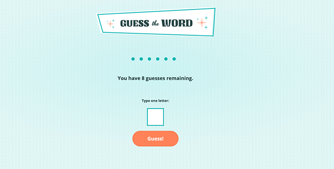

# Guess the Word
This interactive game, Guess the Word, fetches and displays a random word on the screen for users to guess. Built with JavaScript and an API.

## About
In the Guess the Word game, users have 8 attempts to guess the correct word, entering one letter at a time.

The game:

- displays correctly guessed letters in the word,

- tells users how many attempts are left if they guess incorrectly,

- displays which letters users have already guessed,

- notifies users if they entered an already guessed letter or their input is invalid, and 

- reveals a “Play Again” button when it finishes.

## Project Background
The Guess the Word game was a project I built as part of Skillcrush’s “JavaScript Fundamentals” course. 

JavaScript and an API call are used to fetch random words from a text file and display them on the screen. User input is validated to secure only alphabetic characters are entered, and the script counts down and displays the remaining number of guesses.  

Both correctly and incorrectly guessed letters are shown on the screen, and messages are displayed throughout the game in response to user actions and game progress. 

During this project, I practiced:

- Applying logic and working with the DOM to direct the flow of the game, track game progress, and display the appropriate data and messages for the user on the screen.

- Using an asynchronous function to fetch data from a text file containing over 800 random words. 

- Splitting the fetched data into arrays of words and letters, using the split() method and delimiters. 

- Pulling a random index (word) from an array using Math.random() and Math.floor().   

- Removing whitespace around the pulled words with the trim() method. 

- Applying a for loop to use the push() method to add placeholders and letters, respectively, to an array for each letter in the pulled word, and later joining the arrays back together to a string with the join() method.  

- Using a regular expression along with the match() method to validate if the user’s input is a letter.

- Using if statements to check for conditions such as: 

    - whether the pulled word includes the user’s letter
    - if the letter is already guessed 
    - whether there are any remaining guesses left
    - if the user guessed the word and won. 

- Utilizing template literals to update data and user messages on the screen.  

## Built With 
- JavaScript
- API
- HTML5 
- CSS3 

## Launch
[See the live version of the Guess the Word game here.](https://lonemortensen.github.io/guess-the-word/)

## Acknowledgements
**Skillcrush** - I coded the JavaScript file for the Guess the Word game with support and guidance from Skillcrush. The game’s HTML and CSS files were provided by Skillcrush. 
